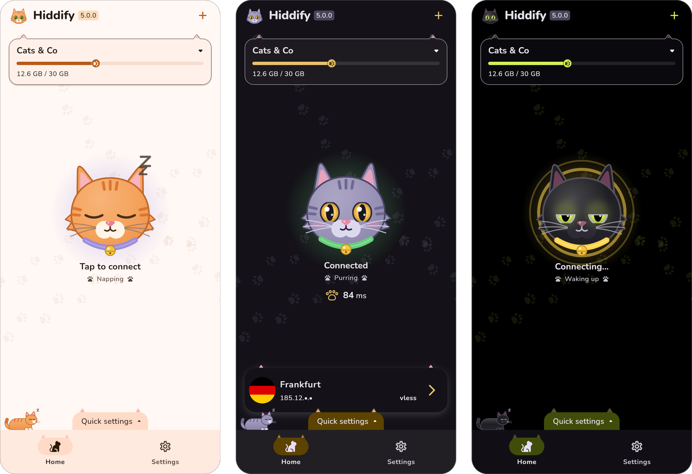
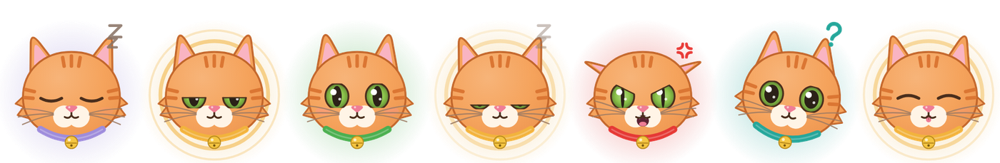
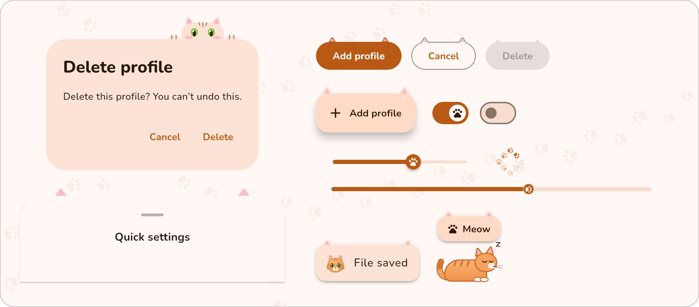
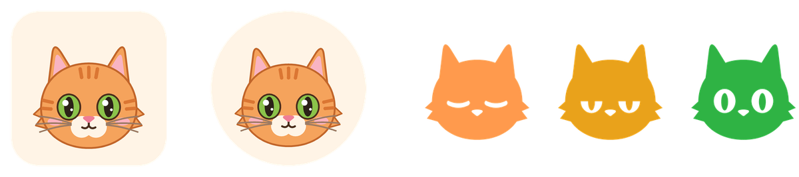

<div align="center">


# Hiddify Cat Edition

**An unofficial fork of [Hiddify](https://github.com/hiddify/hiddify-app), dressed as a cat.**<br>
The same proxy client, core and features. What changed is how it looks and feels.

**English** · [Русский](README_ru.md)

<br>



</div>

## 🐾 What's different

### The connect button is a cat

The big button on the home screen is a cat, and its mood follows the connection.

<p align="center"></p>

| Mood | When |
| --- | --- |
| Napping | Disconnected |
| Waking up | Connecting, or connected while the first ping is on its way |
| Purring | Connected |
| Dozing off | Disconnecting |
| Hissing | The connection failed |
| Curious | Changed settings wait for a reconnect |
| Grooming | A hot reload applies new settings |

- Tap the cat to connect or disconnect, as before. It also gets a boop on the nose.
- Long-press it to pet it: its eyes close, hearts float up and the phone purrs with haptic feedback.
- Its eyes follow your finger, or the mouse pointer, anywhere on the home screen.
- The glow around it and its collar take the color of the connection: lavender, amber, green, teal or red. A new connection gets a burst of hearts.
- A short line under the status names its mood.

### A cat for every theme

| Light | Dark | True black |
| --- | --- | --- |
| A ginger tabby on cream | A grey cat with amber eyes on a night-purple page | A black cat with glowing lime eyes |

The cat palettes replace the system's Material You colors.

### Ears and paws everywhere

<p align="center"></p>

- **Ears** on buttons, floating buttons, cards, menus, tooltips, chips, bottom sheets and the navigation indicator. On buttons they perk up when pressed, lift on hover and droop when the button is disabled. The active profile card pricks its ears up.
- **A cat peeks over every dialog**, holding the edge with its paws and reading along.
- **Paws** on slider and switch thumbs and next to the ping. Loading spinners are paw prints walking in a circle. The traffic bar of a profile ends in a toe bean, and turns red once 90% of the traffic is used.
- **Paw-print trails** cross the home screen, and a fresh print appears wherever you touch it.
- **A cat loafs on the navigation bar**, or on the stats panel on desktop. Tap it and it wakes up and meows. It steps aside while the keyboard is open.
- **Toasts** start with a small cat: purring on success, hissing on an error, curious otherwise. A page that fails to load shows a hissing cat too.
- **Cats replace the logo** in the app bar, in About and on the first-run screen. Tap one and it says "Meow".
- **Navigation icons**: a cat for Home, a paw for Profiles, a cat with a shield for About.
- **Nunito**, a rounded font, for Latin and Cyrillic. Persian, Arabic and Chinese keep their fonts.

### Icons

<p align="center"></p>

The ginger cat is the app icon on every platform, on the launch screens and in notifications. The tray icon shows the connection with its eyes: shut while disconnected, half open while connecting, wide open once connected. That still works on macOS, where the menu bar drops the colors.

### Good to know

- When the system asks for fewer animations, every cat keeps still.
- The home cat moves only while the home screen is open, never in the background. The cat on the navigation bar moves in short bursts and keeps still in between.
- The Nowruz image of the connect button is gone.
- Eight new strings, the "Meow" and the seven moods, are translated into all 11 languages of the app.

## 📥 Get it

There are no releases of the cat edition yet, so build it from source. The [Hiddify releases](https://github.com/hiddify/hiddify-app/releases) are the regular app, without the cats.

## 🛠 Build

The cat edition builds like Hiddify, with Flutter 3.38.5. Prepare the platform, then run the app:

```bash
make android-prepare   # or windows-, linux-, macos-, ios-prepare
flutter run
```

[CONTRIBUTING.md](CONTRIBUTING.md) has the details; the `make *-release` targets build the release packages.

The cats are drawn in code, in [`lib/core/theme/cat`](lib/core/theme/cat) and [`lib/core/widget/cat`](lib/core/widget/cat). The icons are drawn from the same shapes. After changing them, redraw every icon with:

```bash
pip install pillow
python3 scripts/cat_icons/make_icons.py .
```

## ✨ Everything else is Hiddify

Hiddify is a multi-platform proxy client built on [Sing-box](https://github.com/SagerNet/sing-box), ad-free and open source:

- Android, iOS, Windows, macOS and Linux
- Vless, Vmess, Reality, TUIC, Hysteria, Wireguard, SSH and more
- Sing-box, V2ray, Clash and Clash Meta subscriptions, updated automatically
- Node selection by delay, TUN mode, the remaining days and traffic of a subscription
- Settings suited to Iran, China, Russia and other countries

The [Hiddify wiki](https://hiddify.com/app/) has the guides.

## ❤️ Credits and license

- All of the proxy client is [Hiddify](https://github.com/hiddify/hiddify-app), by the Hiddify team and its contributors. Hiddify's own README is [upstream](https://github.com/hiddify/hiddify-app#readme), and its translations are in this repository: [فارسی](README_fa.md), [简体中文](README_cn.md), [日本語](README_ja.md), [Português](README_br.md).
- Hiddify builds on [Sing-box](https://github.com/SagerNet/sing-box), [Sing-box for Android](https://github.com/SagerNet/sing-box-for-android), [Sing-box for Apple](https://github.com/SagerNet/sing-box-for-apple), [Clash](https://github.com/Dreamacro/clash), [Clash Meta](https://github.com/MetaCubeX/Clash.Meta), [FClash](https://github.com/Fclash/Fclash), the [Vazirmatn font](https://github.com/rastikerdar/vazirmatn) by Saber Rastikerdar and [more](pubspec.yaml).
- The cat edition's font is [Nunito](https://github.com/googlefonts/nunito), under the [SIL Open Font License 1.1](assets/fonts/Nunito-OFL.txt).
- The cat edition is licensed like Hiddify, under the [Hiddify Extended GNU GPL v3](LICENSE.md) ([original](https://github.com/hiddify/hiddify-app/blob/main/LICENSE.md)). Its additional conditions apply, among them: noncommercial use only, releases built with GitHub Actions, and no app store release with a name or interface close to Hiddify's.
