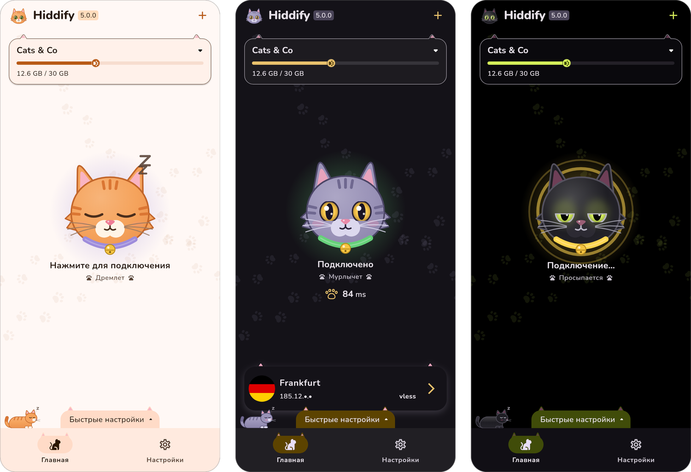
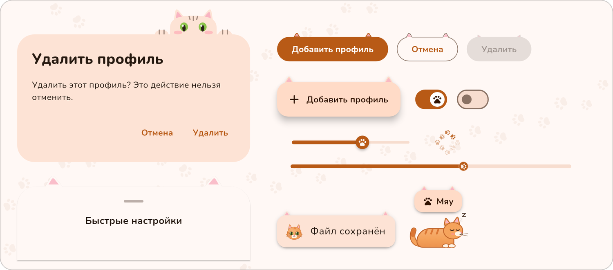

<div align="center">


# Hiddify Cat Edition

**Неофициальный форк [Hiddify](https://github.com/hiddify/hiddify-app), переодетый в кота.**<br>
Тот же прокси-клиент, то же ядро и те же возможности. Поменялось только то, как он выглядит и ощущается.

[English](README.md) · **Русский**

<br>



</div>

## 🐾 Что изменилось

### Кнопка подключения — это кот

Большая кнопка на главном экране — кот, и по его настроению видно, что с подключением.

<p align="center"></p>

| Настроение | Когда |
| --- | --- |
| Дремлет | Подключения нет |
| Просыпается | Идёт подключение, или подключено, но первый пинг ещё не пришёл |
| Мурлычет | Подключено |
| Засыпает | Идёт отключение |
| Шипит | Подключиться не вышло |
| Любопытствует | Изменённые настройки ждут переподключения |
| Умывается | Hot reload применяет новые настройки |

- Тап по коту подключает и отключает, как и раньше, а кот заодно получает «буп» в нос.
- Долгое нажатие гладит кота: глаза закрываются, летят сердечки, телефон мурлычет вибрацией.
- Глаза следят за пальцем или курсором по всему главному экрану.
- Свечение вокруг кота и ошейник окрашены в цвет подключения: лавандовый, янтарный, зелёный, бирюзовый или красный. Новое подключение кот встречает россыпью сердечек.
- Под статусом короткая строка с настроением кота.

### Свой кот для каждой темы

| Светлая | Тёмная | Чёрная |
| --- | --- | --- |
| Рыжий полосатый на кремовом фоне | Серый с янтарными глазами на ночном фиолетовом | Чёрный со светящимися лаймовыми глазами |

Кошачьи палитры заменяют системные цвета Material You.

### Уши и лапки повсюду

<p align="center"></p>

- **Уши** у кнопок, плавающих кнопок, карточек, меню, подсказок, чипов, нижних панелей и индикатора навигации. У кнопок они встают при нажатии, приподнимаются при наведении и опускаются, когда кнопка неактивна. Карточка активного профиля держит уши торчком.
- **Над каждым диалогом выглядывает кот**: держится лапками за край и читает текст.
- **Лапки** на ползунках слайдеров и переключателей и рядом с пингом. Спиннеры загрузки — следы лап по кругу. Полоса трафика профиля заканчивается подушечкой лапы и краснеет, когда израсходовано 90% трафика.
- **Следы лап** тянутся через главный экран, а в месте касания появляется свежий отпечаток.
- **Кот дремлет на панели навигации**, а на десктопе — на панели статистики. Если по нему тапнуть, он проснётся и мяукнет. Пока открыта клавиатура, он уходит.
- **Уведомления** начинаются с маленького кота: мурлычет при успехе, шипит при ошибке, любопытствует в остальных случаях. Страница, которая не загрузилась, тоже показывает шипящего кота.
- **Коты вместо логотипа** в шапке, в «О программе» и на первом экране. Если тапнуть по коту, он скажет «Мяу».
- **Иконки навигации**: кот для главной, лапа для профилей, кот со щитом для «О программе».
- **Nunito**, округлый шрифт, для латиницы и кириллицы. У персидского, арабского и китайского шрифты остались свои.

### Иконки

<p align="center"></p>

Рыжий кот стал иконкой приложения на всех платформах, на экранах запуска и в уведомлениях. Иконка в трее показывает подключение глазами: закрыты, пока подключения нет, приоткрыты во время подключения и широко открыты, когда подключено. Это работает и на macOS, где строка меню убирает цвета.

### Полезно знать

- Если в системе включено уменьшение анимаций, все коты замирают.
- Главный кот двигается, только пока открыт главный экран, в фоне никогда. Кот на панели навигации двигается короткими сериями, а между ними замирает.
- Картинки к Новрузу на кнопке подключения больше нет.
- Восемь новых строк, «Мяу» и семь настроений, переведены на все 11 языков приложения.

## 📥 Где взять

Релизов кошачьей версии пока нет, её нужно собрать из исходников. [Релизы Hiddify](https://github.com/hiddify/hiddify-app/releases) — это обычное приложение, без котов.

## 🛠 Сборка

Кошачья версия собирается так же, как Hiddify, на Flutter 3.38.5. Сначала подготовка платформы, потом запуск:

```bash
make android-prepare   # или windows-, linux-, macos-, ios-prepare
flutter run
```

Подробности — в [CONTRIBUTING.md](CONTRIBUTING.md); релизные пакеты собирают цели `make *-release`.

Коты нарисованы кодом, в [`lib/core/theme/cat`](lib/core/theme/cat) и [`lib/core/widget/cat`](lib/core/widget/cat). Иконки нарисованы из тех же форм. После их изменения все иконки перерисовываются так:

```bash
pip install pillow
python3 scripts/cat_icons/make_icons.py .
```

## ✨ Всё остальное — Hiddify

Hiddify — кроссплатформенный прокси-клиент на ядре [Sing-box](https://github.com/SagerNet/sing-box), без рекламы и с открытым исходным кодом:

- Android, iOS, Windows, macOS и Linux
- Vless, Vmess, Reality, TUIC, Hysteria, Wireguard, SSH и другие протоколы
- Подписки Sing-box, V2ray, Clash и Clash Meta с автообновлением
- Выбор узла по задержке, режим TUN, оставшиеся дни и трафик подписки
- Настройки для Ирана, Китая, России и других стран

Инструкции — в [вики Hiddify](https://hiddify.com/app/).

## ❤️ Благодарности и лицензия

- Весь прокси-клиент — это [Hiddify](https://github.com/hiddify/hiddify-app) от команды Hiddify и её контрибьюторов. Оригинальный README Hiddify есть [в исходном репозитории](https://github.com/hiddify/hiddify-app/blob/main/README_ru.md), а его переводы — в этом: [فارسی](README_fa.md), [简体中文](README_cn.md), [日本語](README_ja.md), [Português](README_br.md).
- Hiddify опирается на [Sing-box](https://github.com/SagerNet/sing-box), [Sing-box для Android](https://github.com/SagerNet/sing-box-for-android), [Sing-box для Apple](https://github.com/SagerNet/sing-box-for-apple), [Clash](https://github.com/Dreamacro/clash), [Clash Meta](https://github.com/MetaCubeX/Clash.Meta), [FClash](https://github.com/Fclash/Fclash), [шрифт Vazirmatn](https://github.com/rastikerdar/vazirmatn) от Saber Rastikerdar и [другие проекты](pubspec.yaml).
- Шрифт кошачьей версии — [Nunito](https://github.com/googlefonts/nunito), под лицензией [SIL Open Font License 1.1](assets/fonts/Nunito-OFL.txt).
- Кошачья версия распространяется, как и Hiddify, под [Hiddify Extended GNU GPL v3](LICENSE.md) ([оригинал](https://github.com/hiddify/hiddify-app/blob/main/LICENSE.md)). Действуют её дополнительные условия, среди них: только некоммерческое использование, релизы только через GitHub Actions и никаких публикаций в магазинах приложений под названием или с интерфейсом, похожими на Hiddify.
